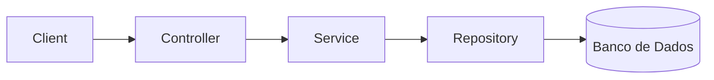

# 📦 API de Produtos

https://img.shields.io/badge/Java-17-blue  
https://img.shields.io/badge/Spring%20Boot-3.x-brightgreen  
https://img.shields.io/badge/MapStruct-1.5-orange  
https://img.shields.io/badge/version-1.0.0-blue

API REST para gerenciamento de produtos e categorias utilizando Spring Boot.

---

## 🚀 Tecnologias

- Java 17
- Spring Boot 3.x
- Spring Data JPA
- Hibernate
- H2 / Banco relacional
- MapStruct
- Lombok
- OpenAPI / Swagger

---

## 🧱 Arquitetura

### 📊 Diagrama


### 📐 Camadas

* Controller → recebe requisições (DTO)
* Service → regras de negócio
* Repository → acesso a dados
* Mapper → conversão DTO ↔ Entity

***

## 📌 Funcionalidades

### 📂 Categoria

* Criar
* Listar
* Buscar por ID
* Atualizar
* Deletar

### 📦 Produto

* Criar
* Listar
* Buscar por ID
* Atualizar
* Deletar

***

## 🔄 Relacionamento

* Produto → Categoria (**Many-to-One**)
* Categoria → Produto (**One-to-Many**)

***

## 📥 Request (Produto)

```json
{
  "nome": "Notebook",
  "descricao": "Notebook gamer",
  "valor": 5000.0,
  "categoriaId": 1
}
```

***

## 📤 Response

```json
{
  "id": 1,
  "nome": "Notebook",
  "descricao": "Notebook gamer",
  "valor": 5000.0,
  "categoria": {
    "id": 1,
    "nome": "Eletrônicos"
  }
}
```

***

## 🧪 Testes com Swagger

```
http://localhost:8080/swagger-ui/index.html
```

✔ Teste endpoints diretamente  
✔ Try it out disponível

***

## 🔀 MapStruct

* Create → `toEntity()`
* Update → `@MappingTarget`

```java
void updateEntity(ProdutoRequestDTO dto, @MappingTarget Produto entity);
```

***

## ✅ Boas práticas aplicadas

* Não expor entidades JPA
* DTO separado (Request / Response)
* Relacionamento via ID no request
* MapStruct para conversão
* Tratamento de exceções

***

## ▶️ Execução

```bash
mvn clean install
mvn spring-boot:run
```

***

## ⚙️ Configuração UTF-8

```xml
<properties>
    <project.build.sourceEncoding>UTF-8</project.build.sourceEncoding>
</properties>
```

***

## 🏷️ Versão

v1.0.0

***

## Autor

Projeto desenvolvido para prática de API REST com Spring Boot.


